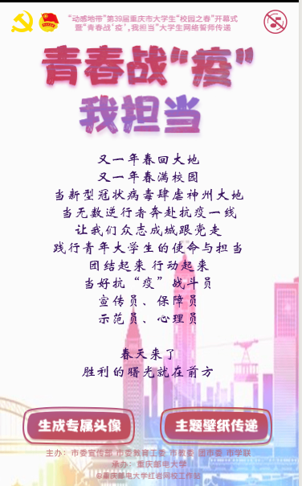
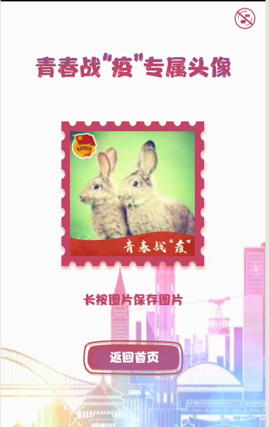

### 整体结构

为了方便只展示 src 目录下的文件

```
├─assets            // 静态资源文件存放图片和字体文件
│  ├─font				// 字体文件 https://www.lcddjm.com/font 提取所需要的字
│  ├─*.png
|  ...
├─component       	// 每个页面所需要的组件    
│  ├─Audio	    		// 音乐
│  ├─Background			// 背景
│  ├─MusicControl	    // 音乐控制
├─pages             // 页面文件
│  ├─AvatarGenerate	    // 头像生成
│  ├─Index				// 首页
│  ├─Wallpaper			// 壁纸
```

## 技术栈

- React
- react-router-dom // 路由
- react-spring // 动画
- styled-components // CSS-in-JS
- styled-normalize // 重置默认 CSS 样式
- styled-px2vw // px to vw
- react-id-swiper // 让 swiper 更适合 react
- swiper // 触摸内容滑动 js 插件


## 项目运行

使用 [Create React App](https://github.com/facebook/create-react-app) 创建，按照标准即可完成

环境变量文件 根目录 `.env`

```
REACT_APP_BE_URL=
REACT_APP_GA=
REACT_APP_NAME=
REACT_APP_DESC=
REACT_APP_ICO=
REACT_APP_FE_URL=
REACT_APP_SENTRY=
```


## 注意点

本项目有多个分支

- master 第一个视觉版本
- new 第二个视觉版本
- withoutForginObject 修复微信不支持 ForginObject

**ForginObject**

安卓下的微信的浏览器不支持 svg 的 ForginObject，故排除大多第三方库，所以使用 canvas 画主要内容。

- 字体问题

  因为在 canvas 中使用远程字体，需要先使用 dom 元素加载

  ```html
  <div style={{
      fontFamily: 'font',
      height: 0,
      width: 0,
  }}>
   	1
  </div>
  ```

- 文字布局问题

  可以通过 CanvasRenderingContext2D.measureText() 方法量出字的具体大小

- 远程图片问题

  有可能在生成 canvas 时图片没加载完所以就在 HTMLImageElement.onload 的回调函数中，然后通过 Promise 的 resolve 抛出去

**微信分享**

有很大几率微信的 js 没有加载完就调用了分享代码，所以就使用 dom 动态的加载并监听 onload 事件，但是微信不能通过这样的方式完成注册，所以静态的 html 也保留。


## 图例






